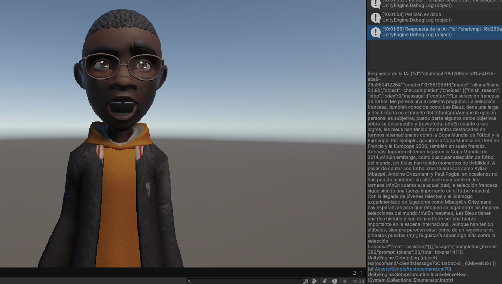

# PR10-II-IAChatBot
## Introducción
En esta práctica haremos uso de, mediante una petición http, una ia generativa que respondía a una pregunta mediante texto que le realizaramos en el inspector, en mi caso la pregunta fue: "que opinas de la seleccion fracesa actual", en nuestro grupo añadimos un asset de un avatar que tenia una animacion de hablar para hacer mas visual.
## Prueba

